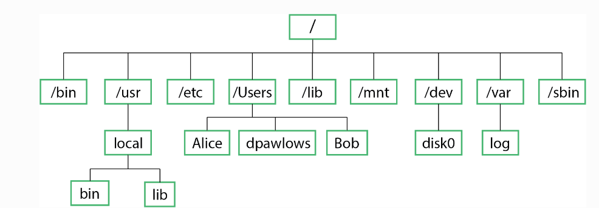

## Basic Commands Practice:

1. Navigation: Use `ls, cd, pwd, mkdir, rmdir` to navigate and manage directories.

```
mkdir physics_data
cd physics_data
touch experiment1.txt
ls
```

2. File Operations: Practice copying, moving, and deleting files.

```
cp experiment1.txt backup.txt
mv backup.txt experiment_backup.txt
rm experiment_backup.txt
```
**Hands-On Exercise:**

Create a directory structure for a hypothetical physics project. Include directories like data, scripts, and results. Add some sample files in each directory and practice navigating and managing them.


3. File Management and Permissions

- **Check Permissions:** Use `ls -l` to view file permissions.

`ls -l experiment1.txt`

- **Change Permissions:** Use `chmod` to modify permissions.

`chmod 644 experiment1.txt  # Read/write for owner, read-only for others`

- *Change Ownership:* Use chown to change file ownership.

`sudo chown yourusername:yourusername experiment1.txt`

**Hands-On Exercise:**

Change the permissions of a file so that only the owner can write to it, and verify the changes. Try changing ownership and check if you can access the file.


## Linux File System


<figure style="text-align: right;">
  
  <figcaption style="text-align: center;">Fig.1: The top levels of a typical Linux filesystem</figcaption>
</figure>


**Key File Structure and Roles**

- Root Directory (/)
Role: The starting point of the file system hierarchy, often called the "root". All other directories and files branch from here.
Relevance: Everything is contained under /. Understanding this will help in knowing where files and programs reside.

- /bin (Binaries)
Role: Contains essential system binaries and commands that are required for the system to boot and operate, such as ls, cp, and mv.
Relevance: Frequently used commands are stored in /bin for tasks like moving between directories or managing files. For example, running cp or rm to manage files in a project.

- /usr (User Programs)
Role: Contains user-installed programs and libraries. It has subdirectories like /usr/bin for binaries and /usr/lib for libraries.
Relevance: When installing additional software (e.g., Python, LaTeX), the binaries often go here.

- /lib (Libraries)
Role: Contains essential libraries for binaries in /bin and /sbin. These libraries are necessary for basic system functionality.
Relevance: While they won’t interact with it directly, understanding that libraries stored here are used by the system or scientific computing programs is crucial.

- /etc (Configuration Files)
Role: Stores system-wide configuration files. For example, network settings, user permissions, and software configuration files are stored here.
Relevance: When managing custom configurations for physics software, one might edit files here. For instance, configuring a computational environment or setting up remote access to data resources.

- /home (User Home Directories)
Role: Each user has a personal directory here (e.g., /home/alice), where their personal files, scripts, and projects are stored.
Relevance: This is where workings are stored, such as physics simulations, datasets, and LaTeX reports. It is the directory where one should focus their organisational efforts for computational work.

- /dev (Devices)
Role: Holds device files that represent hardware components like hard drives, USBs, etc.
Relevance: When working with large-scale datasets in computational physics, one might mount external storage devices from here.

- /mnt and /media (Mount Points)
Role: Temporary mount points for removable storage, such as USB drives or external hard drives.
Relevance: To load external datasets or backup results from computational experiments.

- /tmp (Temporary Files)
Role: Stores temporary files created by programs. These files are often deleted when the system reboots.
Relevance: In computational physics, programs like simulations might store temporary data here. It’s a space one should know to avoid placing permanent data, as files can be erased automatically.

- /var (Variable Data)
Role: Contains files that are expected to grow in size, such as system logs and databases.
Relevance: In large-scale computations, log files from programs might be stored here. This can be useful for debugging physics simulations.

- /sbin (System Binaries)
Role: Stores essential system binaries that are used for administrative tasks like networking, disk partitioning, etc.
Relevance: Advanced researchers working with supercomputers or managing their own Linux servers may need to use administrative tools found here for setting up their computational environment.

- /Users
Role: Some systems (particularly macOS and Unix-based systems) may use this to store user directories like Alice and Bob.
Relevance: Similar to /home in Linux systems, this is where one would store their personal projects and data.


## Advanced Linux Commands – Detailed Examples and Hands-On Exercise
This section covers advanced Linux commands with a focus on text processing, which is very useful in computational physics or data analysis tasks. Let’s explore grep, awk, and sed with examples that could be applied to a physics experiment dataset.

- `grep`—Search for Patterns in Files
The grep command is used to search for specific patterns of text within files. You can look for keywords, phrases, or numbers that match your query.
Example:  Let's say we have a physics experiment log in several .txt files and we need to search for lines mentioning the word "voltage" in all .txt files.
bash
`grep "voltage" *.txt`

This command will return every line containing "voltage" across all .txt files in the directory.
You can also use options like -i to ignore case and -n to show line numbers.

**Hands-On Example:**

Let’s assume we have a file `experiment1.txt` that contains:


```
time: 12:00	voltage: 2.5V
time: 12:30	current: 0.5A
time: 01:00	voltage: 2.7V
```
To search for all lines mentioning `voltage`, you would use:

`grep "voltage" experiment1.txt`

**Output:**
```time: 12:00	voltage: 2.5V
time: 01:00	voltage: 2.7V
```
- `awk`–Process and Analyze Text Data
The awk command is a powerful text processing tool that can extract and analyse columns of data in files. It is especially useful when working with structured data like CSVs or space-separated values. 
Example: If you have a file where columns represent time, voltage, and current, and you want to extract just the time from `experiment1.txt`:
`awk '{print $1}' experiment1.txt`
This command will print the first column, which is time in this case.
	
**Hands-On Example:**
Given the same `experiment1.txt` file:
```
time: 12:00	voltage: 2.5V
time: 12:30	current: 0.5A
time: 01:00	voltage: 2.7V
```
If you want to extract the voltage values (which are in the third column):
`awk '{print $3}' experiment1.txt`
**Output:**
```
2.5V
0.5A
2.7V
```
You can also perform arithmetic operations in awk. For example, if the voltage values are in a file and you want to calculate their sum, you can use:
`awk '{sum += $3} END {print sum}' experiment1.txt`
- `sed`– Stream Edit Text Files
The `sed` command is used to find and replace text in a file or stream. It's often used to perform batch editing, such as changing variable names or updating experiment data.
Example:  If you want to replace the word "voltage" with "potential" in `experiment1.txt`, you can use:

`sed 's/voltage/potential/g' experiment1.txt > updated_experiment1.txt`
`s/oldtext/newtext/g:` This command replaces all occurrences of oldtext with newtext.
The result will be saved in a new file `updated_experiment1.txt`.
**Hands-On Example:**
For the same `experiment1.txt` file:
```
time: 12:00	voltage: 2.5V
time: 12:30	current: 0.5A
time: 01:00	voltage: 2.7V
```
If you want to replace all instances of `voltage` with `potential`, you can run:
`sed 's/voltage/potential/g' experiment1.txt`
*Output:*
```
time: 12:00	potential: 2.5V
time: 12:30	current: 0.5A
time: 01:00	potential: 2.7V
```
**Hands-On Exercise: Analyzing Physics Experiment Data**
Let’s walk through a complete exercise where you use grep, awk, and sed to manipulate and analyze data from a simple physics experiment.
- **Step 1:** Create a Sample Data File
Create a file named `experiment_data.txt` with the following data:
```
time: 10:00	voltage: 3.1V	current: 1.2A
time: 10:30	voltage: 3.0V	current: 1.1A
time: 11:00	voltage: 2.9V	current: 1.0A
time: 11:30	voltage: 3.2V	current: 1.3A
time: 12:00	voltage: 3.0V	current: 1.2A
```
- **Step 2:** Use grep to Find Specific Terms
Suppose you want to find all the readings taken at `10:30`. Use:
`grep "10:30" experiment_data.txt`
- **Step 3:** Use `awk` to Extract Columns of Data
Now, extract only the voltage values from this file:
`awk '{print $3}' experiment_data.txt`
This will return the list of voltages.
- **Step 4:** Use `sed` to Modify Data
Let’s assume you’ve realised the voltage readings are in millivolts (mV) instead of volts (V), and you want to modify this in the data. You can replace V with mV like this:
`sed s/V/mV/g experiment_data.txt > updated_experiment_data.txt`

If you want to convert the entire data points rather than just changing the unit label, you’ll need to perform a calculation in addition to modifying the unit label. For instance, if you want to convert voltage readings from millivolts (mV) to volts (V), you'll need to divide each value by 1000.
Here’s how you can do it using `awk` instead of `sed`, since sed is not designed for mathematical operations. Suppose your data is formatted as:
```
time voltage
0	500
1	1500
2	2500
```
And you want to convert the voltage from mV to V.
Using `awk` for Calculation and Unit Conversion:
`awk '{if (NR == 1) {print $1, "voltage(V)"} else {print $1, $2/1000}}' 
experiment_data.txt > updated_experiment_data.txt`
`NR == 1` handles the header row, printing "voltage(V)".
For other rows, it divides the voltage value by 1000.
Combining the Unit Conversion with sed for Label Replacement:
If you also need to replace the unit label in the header or data file, do it in two steps:
`awk '{if (NR == 1) {print $1, "voltage(V)"} else {print $1, $2/1000}}' experiment_data.txt | sed 's/V/mV/g' > updated_experiment_data.txt`
This command combines `awk` to perform the calculation and sed to replace the unit labels if needed.
