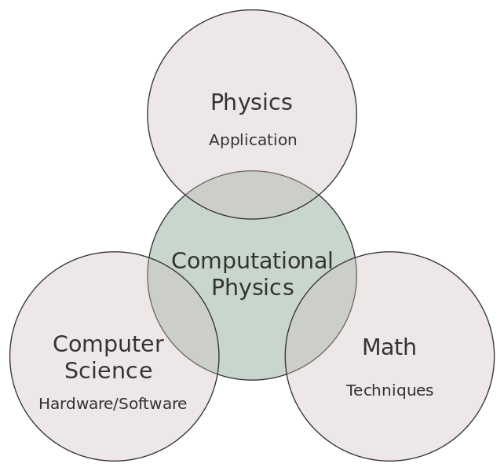

# 1. What is Computational Physics?

Computational physics is a field that merges physics with computational techniques to solve complex problems that are challenging to address analytically. It integrates concepts from physics, computer science, and mathematics to provide powerful solutions and insights. 

## 1.1 The Evolution of Computational Physics

### 1.1.1 Early Applications

Modern computers revolutionized scientific research, and computational physics was one of the first areas to benefit from this advancement. Initially, it focused on simulations and modeling, allowing scientists to explore physical systems in ways that were previously impossible.

### 1.1.2 Current Scope

Today, computational physics has evolved significantly. It is a core component of computational sciences, extending beyond simulations to address a wide range of scientific and practical problems. Its applications now span various domains, from fundamental research to real-world problem-solving.

## 1.2 Why Computational Physics is Important

Computational physics provides essential tools for understanding and predicting complex physical phenomena. It supports:

- **Detailed Simulations:** Creating models of physical systems to predict behavior and test theories.
- **Problem Solving:** Addressing problems that are analytically intractable or too complex for traditional methods.
- **Interdisciplinary Applications:** Contributing to fields such as materials science, astrophysics, and climate modeling.

## 1.3 Essential Background Knowledge

To excel in computational physics, familiarity with several key areas is crucial:

### 1 Root Finding

- **Newton-Raphson Method:** A numerical technique used to find approximate solutions to equations that cannot be solved exactly. It’s fundamental for solving non-linear problems.

### 2 Systems of Linear Equations

- **LU Decomposition:** A method for solving systems of linear equations by decomposing a matrix into lower and upper triangular matrices, simplifying the solution process.

### 3 Ordinary Differential Equations (ODEs)

- **Runge-Kutta Methods:** A family of algorithms used to solve ODEs, which describe how physical quantities change over time. These methods are essential for modeling dynamic systems.

### 4 Integration

- **Monte Carlo Integration:** A statistical technique used to approximate the value of integrals. It’s particularly useful for handling complex systems where analytical solutions are difficult.

### 5 Partial Differential Equations (PDEs)

- **Finite Difference Method:** A numerical approach for solving PDEs, which are used to model phenomena that vary over both space and time. This method is crucial for simulations involving physical processes.

### 6 Matrix Manipulation

- **Matrix Operations:** Efficient manipulation and computation involving matrices are fundamental for various numerical methods and simulations.

## 1.4 Conclusion

Computational physics is a dynamic and essential field that harnesses computational power to solve a wide array of physical problems. Its ability to simulate complex systems and address challenging scientific questions makes it a vital tool in modern science and engineering.
